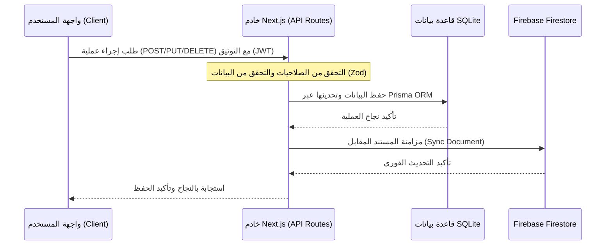

# توثيق معمارية وترابط قواعد البيانات (SQLite & Firebase Firestore)

تم تصميم هذا المستند لتوضيح معمارية قواعد البيانات المزدوجة المستخدمة في مشروع **Red Sea Protected Areas System (RED)**، وكيفية ترابطهما ومزامنة البيانات بينهما لضمان الاستمرارية والتحكم الكامل في جميع أجزاء الموقع.

---

## 🏛️ الفلسفة المعمارية (Architectural Design)

يعتمد المشروع على قاعدتي بيانات مختلفتين، وتعمل كل منهما بدور محدد ومكمّل للأخرى لتحقيق أقصى درجات الأمان والكفاءة:

1. **SQLite (بواسطة Prisma ORM):**
   * **الدور الأساسي:** مصدر الحقيقة الفردي والوحيد للبيانات (Single Source of Truth - SSOT).
   * **الخصائص:** تدعم العلاقات القوية، الصفقات (Transactions)، القيود (Constraints)، والاستعلامات المعقدة المطلوبة لتقارير تقييم الأثر البيئي (EIA) والتقارير الإحصائية.
   
2. **Firebase (Cloud Firestore):**
   * **الدور الأساسي:** واجهة قراءة تفاعلية سريعة ومزامنة لحظية (Real-time Read Cache).
   * **الخصائص:** توفر تحديثات فورية للمتصفح عبر اشتراكات `onSnapshot` دون الحاجة لطلب تحديث الصفحة يدويًا (بث حي لحركة الأساطيل، البلاغات الميدانية، والدوريات).

---

## 🔄 مسار تدفق البيانات ومزامنتها (Data Flow & Synchronization)

لمنع حدوث تضارب في البيانات، يتم اتباع قاعدة ذهبية: **لا تُكتب أي بيانات من جهة العميل (Client-side) مباشرة إلى Firebase.**

### 1. مسار الإضافة والتعديل والحذف (Write/Mutation Flow)
عند قيام المستخدم بإجراء أي عملية إضافة أو تعديل أو حذف في لوحة التحكم:



* **التنفيذ العملي:** 
  1. يقوم العميل بإرسال طلب `fetch('/api/staff/...')` إلى خادم Next.js.
  2. يقوم الخادم بتنفيذ العملية على SQLite أولاً عبر Prisma.
  3. فور نجاح الحفظ، يقوم الخادم بتحديث المستند المقابل في Firebase Firestore باستخدام كود المزامنة المشترك في `db-sync.ts`.

### 2. مسار القراءة (Read Flow)
* **القراءة اللحظية (Real-time):** تستخدم مكونات الواجهة الأمامية دالة `subscribeToCollection` للاستماع المباشر لـ Firebase Firestore للتمتع بالتحديث الفوري والحي للبيانات.
* **القراءة التقليدية/المعقدة:** تستدعي الواجهة الأمامية مسارات API التي تستعلم مباشرة من SQLite في حال عدم الحاجة للتحديث اللحظي أو عند وجود علاقات معقدة جداً.

---

## 📂 خريطة مطابقة النماذج (Models Mapping)

| النموذج في SQLite (Prisma) | المجموعات في Firebase (Firestore) | دور النموذج والمزامنة |
| :--- | :--- | :--- |
| `User` | `users` | الحسابات والصلاحيات (تسجيل الدخول يقرأ من SQLite للتأكد من كلمة المرور ثم يطابق البيانات في Firebase). |
| `Patrol` | `patrols` | الدوريات الميدانية والمسارات الجغرافية (تُخلق عبر API وتُزامن فورياً لمراقبة حركة الدوريات حياً). |
| `Violation` | `violations` | المخالفات البحرية والبيئية المكتشفة أثناء الدوريات. |
| `Vessel` | `fleet` | أسطول السفن والزوارق لمراقبة حالتها ومستويات الوقود وساعات عمل المحركات. |
| `Survey` | `observations` | عمليات المسح البيئي وصحة الشعاب المرجانية والأحياء البحرية. |
| `EiaCost`/`EiaInspection`/`EiaAccident` | *لا يوجد* | موديول تقييم الأثر البيئي يدار بالكامل داخل SQLite ولا يحتاج إلى مزامنة فورية في Firebase. |

---

## 🛠️ كيف تضيف حقل أو جدول جديد وتضمن مزامنته؟ (Developer Guide)

للمحافظة على الترابط وتجنب تلف المزامنة مستقبلاً، اتبع الخطوات التالية بالترتيب عند إجراء أي تعديل:

### الخطوة 1: تعديل نموذج Prisma
قم بإضافة الجدول أو الحقول الجديدة في ملف [schema.prisma](file:///d:/%D9%85%D8%B5%D8%B7%D9%81%D9%89%20%D9%84%D8%A7%D9%8A%D9%82/red/prisma/schema.prisma) ثم قم بإنشاء هجرة جديدة وتوليد العميل:
```bash
npx prisma migrate dev --name <migration_name>
```

### الخطوة 2: تعديل واجهة Firebase (Types)
قم بتعديل أو إضافة واجهة البيانات المقابلة (Interface) داخل ملف [schema.ts](file:///d:/%D9%85%D8%B5%D8%B7%D9%81%D9%89%20%D9%84%D8%A7%D9%8A%D9%82/red/src/lib/firebase/schema.ts) لتتوافق الحقول تماماً مع Prisma.

### الخطوة 3: تحديث دالة المزامنة الموحدة
أضف منطق التحويل (Mappers) في ملف `src/lib/db-sync.ts` لضمان تحويل صيغ البيانات المتوافقة (مثل تحويل التواريخ `Date` في Prisma إلى `Timestamp` الخاصة بـ Firebase).

### الخطوة 4: إنشاء مسار API للعملية
تجنب الكتابة مباشرة من العميل. أنشئ مسار API فرعي (مثل `/api/staff/your-feature/route.ts`) للتعامل مع العمليات وتضمين دالة المزامنة السحابية داخله:
```typescript
import { prisma } from '@/lib/prisma';
import { syncToFirebase } from '@/lib/db-sync';

// في دالة POST أو PUT:
const result = await prisma.yourModel.create({ data });
await syncToFirebase('your-collection', result);
```

---

## 🚀 خطة التهيئة الموحدة (Unified Seeding)

لضمان عمل المشروع محلياً بنفس كفاءة البيئة الإنتاجية، يجب تشغيل ملف التهيئة الموحد:
```bash
npm run db:seed
```
يقوم هذا الملف بمسح البيانات القديمة وبناء مستخدمين وبيانات تجريبية متطابقة بالمعرفات (IDs) في كلا قاعدتي البيانات SQLite و Firebase Firestore في نفس اللحظة.
