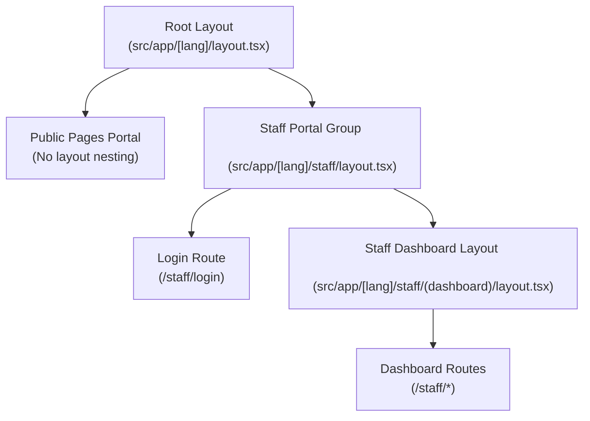

# Route Map & Layout Hierarchy Map

This document presents the complete route map, layout hierarchies, parent layouts, and page dependencies for the **Red Sea Marine Reserves Authority** portal.

---

## 1. Parent Layout Hierarchies

The project uses Next.js App Router and organizes routes into two main layout hierarchies:

### Layout 1: Main/Root Layout
* **Path**: [layout.tsx](file:///D:/MOSTAFA/RED/red/src/app/[lang]/layout.tsx)
* **Responsibilities**:
  * Root HTML/Body markup with direction support (`dir="rtl"` for Arabic, `dir="ltr"` for English).
  * System Configuration metadata generation (via Prisma).
  * Embeds high-performance fonts (`Cairo` for Arabic, `Inter` for English).
  * Embeds SEO JSON-LD configurations and standard head tags.
  * Injects inline local storage script to prevent theme flash (FOUC).
  * Wraps children with client-side `ThemeProvider`.
* **Scope**: Wraps all routes in the system.

### Layout 2: Staff Dashboard Layout
* **Path**: [layout.tsx](file:///D:/MOSTAFA/RED/red/src/app/[lang]/staff/(dashboard)/layout.tsx)
* **Responsibilities**:
  * Checks authentication and routes unauthorized users to `/staff/login`.
  * Checks RBAC permission checks for each route based on user session role (`allowedSections`).
  * Emits presence heartbeat (`/api/staff/presence`) every 60 seconds.
  * Handles responsive sidebars via screen-width detection (`mobile` | `tablet` | `desktop`).
  * Renders `StaffSidebar` component.
  * Adjusts padding and spacing dynamically based on screenMode.
* **Scope**: Wraps all staff dashboard routes under `/[lang]/staff/(dashboard)/*`.

---

## 2. Complete Route Map

### 2.1 Public Face Routes (Root Layout)

| Route Path | Page Component File | Client Component | Shared Layout Components | Theme Dependencies | Data Dependencies |
| :--- | :--- | :--- | :--- | :--- | :--- |
| `/` | `src/app/[lang]/page.tsx` | `HomeClient.tsx` | `PublicNavbar`, `PublicFooter` | CSS Vars, Hero overlay | API: `/api/staff/query?collection=homepage` |
| `/about` | `src/app/[lang]/about/page.tsx` | `AboutClient.tsx` | `PublicNavbar`, `PublicFooter` | CSS Vars | Static Metadata, Hash scroll |
| `/careers` | `src/app/[lang]/careers/page.tsx` | `CareersClient.tsx` | `PublicNavbar`, `PublicFooter` | CSS Vars | API: `/api/staff/query?collection=careers` |
| `/contact` | `src/app/[lang]/contact/page.tsx` | `ContactClient.tsx` | `PublicNavbar`, `PublicFooter` | CSS Vars | Form submissions to contact API |
| `/events` | `src/app/[lang]/events/page.tsx` | `EventsClient.tsx` | `PublicNavbar`, `PublicFooter` | CSS Vars | API: `/api/staff/query?collection=events` |
| `/guide` | `src/app/[lang]/guide/page.tsx` | `GuideClient.tsx` | `PublicNavbar`, `PublicFooter` | CSS Vars, TopographyMap | API: `/api/staff/query?collection=guide` |
| `/guide/species` | `src/app/[lang]/guide/species/page.tsx` | `SpeciesClient.tsx` | `PublicNavbar`, `PublicFooter` | CSS Vars | API: `/api/staff/query?collection=species` |
| `/guide/[section]` | `src/app/[lang]/guide/[section]/page.tsx` | `GuideSubPageClient.tsx` | `PublicNavbar`, `PublicFooter` | CSS Vars | Dynamic segment path lookup |
| `/news` | `src/app/[lang]/news/page.tsx` | `NewsClient.tsx` | `PublicNavbar`, `PublicFooter` | CSS Vars | API: `/api/staff/query?collection=news` |
| `/news/[id]` | `src/app/[lang]/news/[id]/page.tsx` | Inline Details | `PublicNavbar`, `PublicFooter` | CSS Vars | Dynamic segment lookup |
| `/opendata` | `src/app/[lang]/opendata/page.tsx` | `OpenDataClient.tsx` | `PublicNavbar`, `PublicFooter` | CSS Vars, Recharts | API: `/api/staff/query?collection=opendata` |
| `/regulations` | `src/app/[lang]/regulations/page.tsx` | `RegulationsClient.tsx` | `PublicNavbar`, `PublicFooter` | CSS Vars | API: `/api/staff/query?collection=regulations` |
| `/reserves` | `src/app/[lang]/reserves/page.tsx` | `ReservesClient.tsx` | `PublicNavbar`, `PublicFooter` | CSS Vars | API: `/api/staff/query?collection=reserves` |
| `/reserves/[id]` | `src/app/[lang]/reserves/[id]/page.tsx` | Inline Details | `PublicNavbar`, `PublicFooter` | CSS Vars, Recharts | Dynamic segment lookup |
| `/statistics` | `src/app/[lang]/statistics/page.tsx` | `StatisticsClient.tsx` | `PublicNavbar`, `PublicFooter` | CSS Vars, Recharts | API: `/api/staff/query?collection=eco_programs` |

### 2.2 Auth Routes (Root Layout)

| Route Path | Page Component File | Shared Layout Components | Theme Dependencies | Data Dependencies |
| :--- | :--- | :--- | :--- | :--- |
| `/staff/login` | `src/app/[lang]/staff/login/page.tsx` | Inline controls | CSS Vars, dark mode styles | API: `/api/auth/login` |

### 2.3 Staff Dashboard Routes (Staff Dashboard Layout)

| Route Path | Page Component File | Client Component / Modals | Shared Layout Components | Theme Dependencies | Data Dependencies |
| :--- | :--- | :--- | :--- | :--- | :--- |
| `/staff` | `src/app/[lang]/staff/(dashboard)/page.tsx` | `DashboardClient.tsx`, `UnifiedAIAssistant` | `StaffSidebar` | CSS Vars, Glass panels | API: `/api/staff/presence`, `/api/staff/query` |
| `/staff/eia` | `src/app/[lang]/staff/(dashboard)/eia/page.tsx` | `EIAReportModal`, `MapComponent` | `StaffSidebar`, `Card`, `Badge` | Map styles, Hardcoded dark gradients | API: `/api/eia/*` (costs, inspections, violations, accidents) |
| `/staff/email-routing`| `src/app/[lang]/staff/(dashboard)/email-routing/page.tsx` | `EmailRoutingClient.tsx` | `StaffSidebar`, `Card` | CSS Vars | API: `/api/staff/email-routing` |
| `/staff/fleet` | `src/app/[lang]/staff/(dashboard)/fleet/page.tsx` | Inline forms | `StaffSidebar`, `Card`, `Button` | Hardcoded dark panels | API: `/api/staff/query?collection=fleet` |
| `/staff/gis` | `src/app/[lang]/staff/(dashboard)/gis/page.tsx` | Leaflet integrations | `StaffSidebar`, `Card` | Hardcoded Map colors | GIS API / Map layers |
| `/staff/media` | `src/app/[lang]/staff/(dashboard)/media/page.tsx` | Sub-media navigators | `StaffSidebar`, `Card` | CSS Vars | Media schema integrations |
| `/staff/media/guide` | `src/app/[lang]/staff/(dashboard)/media/guide/page.tsx` | Inline editors | `StaffSidebar`, `RichTextEditor` | CSS Vars | Media edit endpoints |
| `/staff/media/homepage`| `src/app/[lang]/staff/(dashboard)/media/homepage/page.tsx`| Inline editors | `StaffSidebar`, `RichTextEditor` | CSS Vars | Media edit endpoints |
| `/staff/media/news` | `src/app/[lang]/staff/(dashboard)/media/news/page.tsx` | Inline editors | `StaffSidebar`, `RichTextEditor` | CSS Vars | Media edit endpoints |
| `/staff/media/opendata`| `src/app/[lang]/staff/(dashboard)/media/opendata/page.tsx`| Inline editors | `StaffSidebar`, `RichTextEditor` | CSS Vars | Media edit endpoints |
| `/staff/media/reserves`| `src/app/[lang]/staff/(dashboard)/media/reserves/page.tsx`| Inline editors | `StaffSidebar`, `RichTextEditor` | CSS Vars | Media edit endpoints |
| `/staff/monitoring` | `src/app/[lang]/staff/(dashboard)/monitoring/page.tsx`| `MonitoringClient.tsx`, `EcoMap`, `ReportModal` | `StaffSidebar`, `Card`, `Badge` | Hardcoded loading colors | API: `/api/staff/query?collection=*` (eco_programs, stranding_cases, sightings, beach_surveys) |
| `/staff/patrols` | `src/app/[lang]/staff/(dashboard)/patrols/page.tsx` | `EnvironmentalConditions` | `StaffSidebar`, `Card`, `Button` | Hardcoded dark cards | API: `/api/staff/patrols?limit=100` |
| `/staff/patrols/new` | `src/app/[lang]/staff/(dashboard)/patrols/new/page.tsx` | `PatrolMap` | `StaffSidebar`, `Card`, `Button` | Hardcoded dark cards | Mutate API endpoint |
| `/staff/patrols/[id]` | `src/app/[lang]/staff/(dashboard)/patrols/[id]/page.tsx`| Live tracker components | `StaffSidebar`, `Card`, `Button` | Hardcoded dark details | API: `/api/staff/patrols/[id]` |
| `/staff/profile` | `src/app/[lang]/staff/(dashboard)/profile/page.tsx` | Profile details | `StaffSidebar`, `Card` | CSS Vars | API: `/api/staff/profile` |
| `/staff/settings` | `src/app/[lang]/staff/(dashboard)/settings/page.tsx` | Settings configuration | `StaffSidebar`, `Card` | CSS Vars | API: SystemConfig mutation |
| `/staff/users` | `src/app/[lang]/staff/(dashboard)/users/page.tsx` | User list inline manager | `StaffSidebar`, `Card` | CSS Vars | API: User endpoints |
| `/staff/violations` | `src/app/[lang]/staff/(dashboard)/violations/page.tsx` | Violations table | `StaffSidebar`, `Card` | CSS Vars | API: Violations logs |
